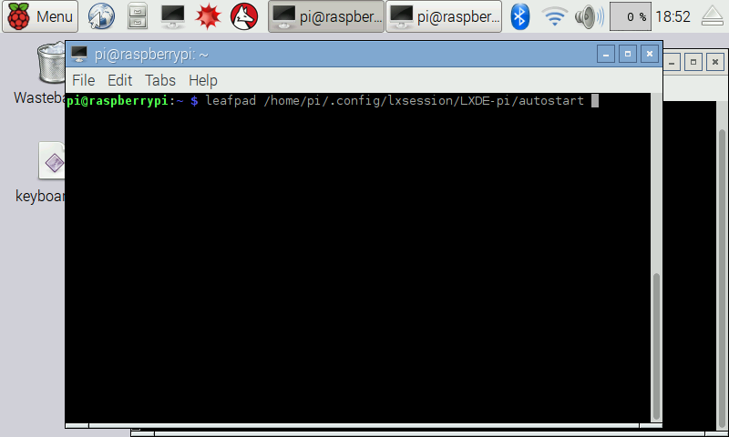
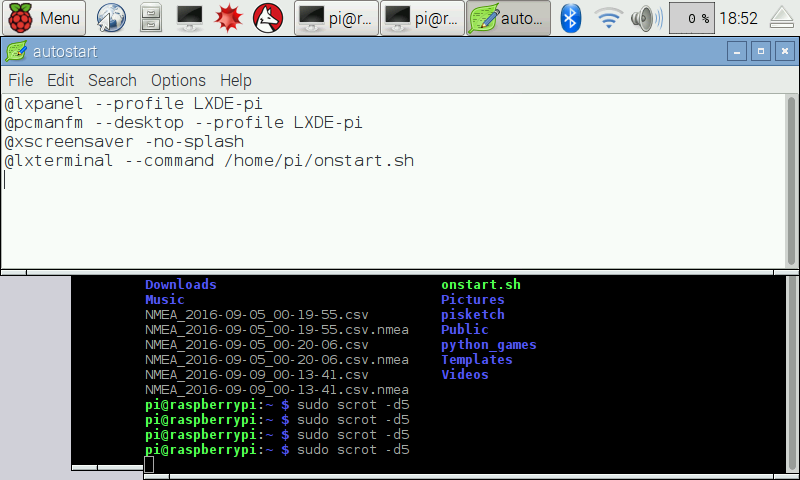
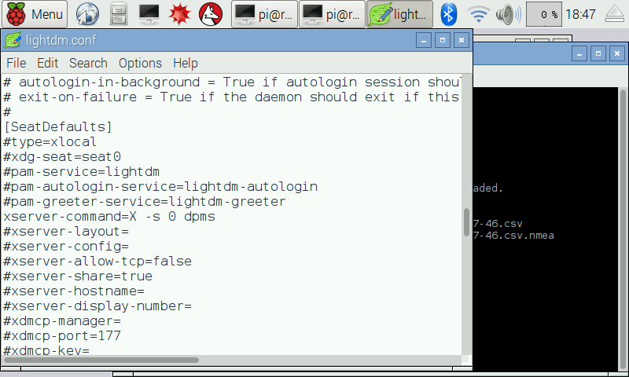
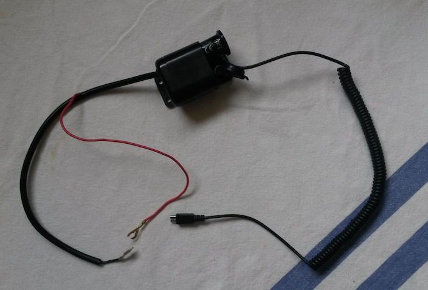
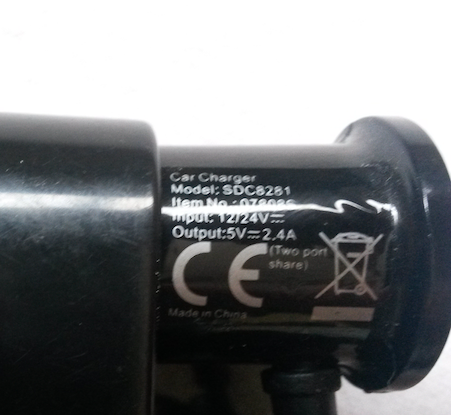

A few months ago I needed to create detailed bathymetric maps for a water utility with which I was doing research. Our usual approach is to use an old Windows XP laptop with a serial port to log data from our Garmin GPS/Depth sounder unit. On the laptop, we used sofware called UnderSee Explorer (formerly Contour3D) which as far as I can tell, is now completely out of business. Usually the lakes we do research on are quite small, and the battery life of our laptops (around a few hours) is not an issue. However, the two lakes we needed to map were massive, and we needed a large amount of detail. All totalled we needed to collect bathymetric data for 5 days, which represented a significant challenge even with multiple batteries.

Enter the Raspberry Pi, which runs on 5 volts and can easily log serial data provided a suitable USB adapter. In the rain, the Raspberry Pi could easily be tucked away in a waterproof container, which was another issue we faced with using laptops in the field. In theory the Rapsberry Pi was an easy solution, all we needed was the Python code to make it happen. 


## PySerial

Luckily, the [PySerial](https://pypi.python.org/pypi/pyserial) library provides easy access to all matter of serial communication (Raspberry Pi and otherwise). The library is easily installed using `pip3` (`pip3 install pyserial`). In Python, the implementation is quite simple:


```python
import serial
with serial.Serial('/dev/tty.usbserial', baudrate=4800, timeout=1) as ser:
    # read 10 lines from the serial output
    for i in range(10):
        line = ser.readline().decode('ascii', errors='replace')
        print(line.strip())
```

    �K��r�bj�,*67
    $GPGSA,A,1,,,,,,,,,,,,,,,*1E
    $GPGSV,2,1,06,18,67,304,42,20,46,103,33,21,62,214,34,24,49,135,00*7C
    $GPGSV,2,2,06,28,03,033,00,32,,,27,,,,,,,,*42
    $GPRMC,195854,V,4425.8867,N,07543.5346,W,000.0,000.0,151116,,,N*7B
    $GPGGA,195855,4425.8867,N,07543.5346,W,0,00,,00000.0,M,-034.0,M,,*66
    $GPGSA,A,1,,,,,,,,,,,,,,,*1E
    $GPGSV,2,1,05,18,67,304,42,20,46,103,34,21,62,214,35,24,49,135,00*79
    $GPGSV,2,2,05,28,03,033,00,,,,,,,,,,,,*45
    $GPRMC,195855,V,4425.8867,N,07543.5346,W,000.0,000.0,151116,,,N*7A


There's a few very important things about this code that took some strategic handling. First, **use the `with` syntax when using serial ports**. You can also `open()` and `close()` `Serial` ports, but failure to do so can lead to unexpected behaviour when opening them again in the future, and handling all of the possible exception cases is a headache. The `with` syntax is much, much easier. Second, the `timeout=1` parameter is essential...it makes sure that when opening a serial port with no output (as you are bound to accidentally do at some point), the program doesn't block indefinitely when calling `readline()`. Third, you may notice that the output is complete jibberish for the first few lines. This is common, as it takes a few lines for the output to get warmed up. However, poorly written code can throw exceptions when trying to deal with this jibberish data, so adding the `errors='replace'` argument to `decode()` is a way to make sure that the `bytes` objects are defensively handled. Fourth, the serial port name. As I write this on a Mac, the serial port name for the first thing that gets plugged in is `/dev/tty.usbserial`. On linux/Raspberry Pi, this is slightly different. My solution is probably not perfect (in particular, I haven't tested it on Windows), but I combined a variety of online suggestions to come up with this:


```python
import sys
import glob
def _scan_ports():
    if sys.platform.startswith('win'):
        ports = ['COM%s' % (i + 1) for i in range(256)]
    elif sys.platform.startswith('linux') or sys.platform.startswith('cygwin'):
        # this excludes your current terminal "/dev/tty"
        patterns = ('/dev/tty[A-Za-z]*', '/dev/ttyUSB*')
        ports = [glob.glob(pattern) for pattern in patterns]
        ports = [item for sublist in ports for item in sublist]  # flatten
    elif sys.platform.startswith('darwin'):
        patterns = ('/dev/*serial*', '/dev/ttyUSB*', '/dev/ttyS*')
        ports = [glob.glob(pattern) for pattern in patterns]
        ports = [item for sublist in ports for item in sublist]  # flatten
    else:
        raise EnvironmentError('Unsupported platform')
    return ports

_scan_ports()
```


    ['/dev/cu.usbserial',
     '/dev/tty.usbserial']


## PyNMEA2

Finally, **what is all the output telling me?**. If you're familiar with NMEA output, this will be old hat to you, but if you're not you probably haven't wrapped your mind around how NMEA works. Essentially, every second or two, everything connected to the GPS system puts out some information, and that information is encoded in **sentences**, or what you see on each line. Each sentence encodes specific pieces of information separated by commas, which has a different meaning based on the first 5 (or so) characters. The exact specification is proprietary, but there is a [particularly good online reference](http://www.gpsinformation.org/dale/nmea.htm) if you're curious. Luckily, the [pynmea2](https://github.com/Knio/pynmea2) library takes care of much of this for us. For example, take a sample `$GPRMC` sentence:


```python
import pynmea2
nmea = '$GPRMC,164125,A,4425.8988,N,07543.5370,W,000.0,000.0,151116,,,A*67'
nmeaobj = pynmea2.parse(nmea)
['%s: %s' % (nmeaobj.fields[i][0], nmeaobj.data[i]) 
     for i in range(len(nmeaobj.fields))]
```


    ['Timestamp: 164125',
     'Status: A',
     'Latitude: 4425.8988',
     'Latitude Direction: N',
     'Longitude: 07543.5370',
     'Longitude Direction: W',
     'Speed Over Ground: 000.0',
     'True Course: 000.0',
     'Datestamp: 151116',
     'Magnetic Variation: ',
     'Magnetic Variation Direction: ']


This may remove some of the confusion surrounding what each field means, but it doesn't tell us some of the more important information (like, what exactly *is* the latitude/longitude based on `07543.5370`?) For this, `pynmea2` provides some additional helper attributes.


```python
nmeaobj.latitude
```


    44.431646666666666


```python
nmeaobj.longitude
```


    -75.72561666666667


```python
nmeaobj.datetime
```


    datetime.datetime(2016, 11, 15, 16, 41, 25)


## PySerial & PyNMEA2

Putting both of these pieces together, I put together a quick command-line interface program that scans all possible serial ports, logging the first valid NMEA output that it finds. This is important, beacuse without having a keyboard attached, the Rapsberry Pi can start the terminal application at boot, and will keep logging output even if errors occur (unplugging, replugging, power failure, etc.). My solution was as follows:


```python
import pynmea2, serial, os, time, sys, glob, datetime

def logfilename():
    now = datetime.datetime.now()
    return 'NMEA_%0.4d-%0.2d-%0.2d_%0.2d-%0.2d-%0.2d.nmea' % \
                (now.year, now.month, now.day,
                 now.hour, now.minute, now.second)

try:
    while True:
        ports = _scan_ports()
        if len(ports) == 0:
            sys.stderr.write('No ports found, waiting 10 seconds...press Ctrl-C to quit...\n')
            time.sleep(10)
            continue

        for port in ports:
            # try to open serial port
            sys.stderr.write('Trying port %s\n' % port)
            try:
                # try to read a line of data from the serial port and parse
                with serial.Serial(port, 4800, timeout=1) as ser:
                    # 'warm up' with reading some input
                    for i in range(10):
                        ser.readline()
                    # try to parse (will throw an exception if input is not valid NMEA)
                    pynmea2.parse(ser.readline().decode('ascii', errors='replace'))
                
                    # log data
                    outfname = logfilename()
                    sys.stderr.write('Logging data on %s to %s\n' % (port, outfname))
                    with open(outfname, 'wb') as f:
                        # loop will exit with Ctrl-C, which raises a
                        # KeyboardInterrupt
                        while True:
                            line = ser.readline()
                            print(line.decode('ascii', errors='replace').strip())
                            f.write(line)
                
            except Exception as e:
                sys.stderr.write('Error reading serial port %s: %s\n' % (type(e).__name__, e))
            except KeyboardInterrupt as e:
                sys.stderr.write('Ctrl-C pressed, exiting log of %s to %s\n' % (port, outfname))

        sys.stderr.write('Scanned all ports, waiting 10 seconds...press Ctrl-C to quit...\n')
        time.sleep(10)
except KeyboardInterrupt:
    sys.stderr.write('Ctrl-C pressed, exiting port scanner\n')
```

Note that everything in the file is written defensively...almost anything can happen while logging, and the program will continue to scan ports and log the NMEA output that it finds. The actual solution I used had a far more complicated loop that actually labelled each piece of output information (using the field labels provided by `pynmea2`, so that troubleshooting was a little easier. That solution is a little lengthy for this blog post, but it was incredibly useful in the field.

## Raspberry Pi Setup

The final step in using the Raspberry Pi to log NMEA data was to setup the Pi itself to log the data. The two main objectives here were to (1) have the Raspberry Pi open a terminal running our `scan_serial.py` file, (2) **never turn off the screen** (after all, what is the point of logging data all day for 5 days if you can't be sure the data ever logged?), and (3) make sure there is an on-screen keyboard available should things go wrong. It may seem that these are trivial Google search issues, but it turns out they are a little more involved (possibly because I have a Raspberry Pi 3, which is still relatively new).

After a few false starts, the solution that ended up working for me was to edit the `autostart` file in `/home/pi/.config/lxsession/LXDE-pi/autostart`. I added the line `@lxterminal --command /home/pi/onstart.sh`. Of course I could have added the exact command I was trying to run, but it is a little easier to wrap the command I was trying to run in a shell script (not to mention having it be easier to find again).





Then I had to create the `/home/pi/onstart.sh` file that contained the script that would run when the Pi booted up. I wrapped the command that launched our looping NMEA logger in an `echo` command (for no particular reason), a `cd "/home/pi"` (to make sure that log files ended up in the home folder and not somewhere else), and finally `sleep 5` (to catch any error messages that appeared as a result of the above code). The launch command was `python3 path/to/scan_serial.py`, or the code that appears above. Remember to `chmod +x` your `onstart.sh` script, or it may not run!


Keeping the screen on took a few more false starts, but of all the solutions a Google was able to find me, the only one that worked was changing the `xserver-command=` line in `/etc/lightdm/lightdm.conf`. It's hard to say what the line read previously, but in the end, the whole line read `xserver-command=X -s 0 dpms`.




## Battery Setup

The one final piece of the puzzle was reliably powering the Pi for a whole day on a 12-volt battery. I had thought this would be trivial, but it turns out the Pi needs at least 1.2A of output to run without shutting down (> 2.0 A is preferable). Many USB adapters only provide 500mA, and some USB cables (especially long ones) loose a significant amount of current between the adapter and the Pi. Looking at the USB adapter carefully is necessary when selecting one for use with the Pi.





For the on-screen keyboard I used matchbox-keyboard (`sudo apt-get install matchbox-keyboard`), and created a launcher script on the desktop.

## Extras

As a part of putting together NMEA data, I put together a list of 'talkers' (fairly sure they were taken from [here](http://www.gpsinformation.org/dale/nmea.htm) at some point) that may be useful in providing more meaningful output.


```python
_NMEA_TALKERS = {'AG': 'Autopilot(General)',
                 'AP': 'Autopilot(Magnetic)',
                 'CC': 'Programmed Calculator',
                 'CD': 'DSC (Digital Selective Calling)',
                 'CM': 'Memory Data',
                 'CS': 'Satellite Communications',
                 'CT': 'Radio-Telephone (MF/HF)',
                 'CV': 'Radio-Telephone (VHF)',
                 'CX': 'Scanning Receiver',
                 'DE': 'DECCA Navigation',
                 'DF': 'Direction Finder',
                 'DM': 'Magnetic Water Velocity Sensor',
                 'EC': 'ECDIS (Electronic Chart Display & Information System)',
                 'EP': 'EPIRB (Emergency Position Indicating Beacon)',
                 'ER': 'Engine Room Monitoring Systems',
                 'GP': 'GPS',
                 'HC': 'Magnetic Compass',
                 'HE': 'North Seeking Gyro',
                 'HN': 'Non-North Seeking Gyro',
                 'II': 'Integrated Instrumentation',
                 'IN': 'Integrated Navigation',
                 'LA': 'Loran A',
                 'LC': 'Loran C',
                 'MP': 'Microwave Positioning System',
                 'OM': 'OMEGA Navigation System',
                 'OS': 'Distress Alarm System',
                 'RA': 'RADAR and/or ARPA',
                 'SD': 'Depth Sounder',
                 'SN': 'Electronic Positioning System',
                 'SS': 'Scanning Sounder',
                 'TI': 'Turn Rate Indicator',
                 'TR': 'TRANSIT Navigation System',
                 'VD': 'Doppler Velocity Sensor',
                 'VW': 'Mechanical Water Velocity Sensor',
                 'WI': 'Weather Instruments',
                 'YC': 'Temperature Transducer',
                 'YD': 'Displacement Transducer',
                 'YF': 'Frequency Transducer',
                 'YL': 'Level Transducer',
                 'YP': 'Pressure Transducer',
                 'YR': 'Flow Rate Transducer',
                 'YT': 'Tachometer Transducer',
                 'YV': 'Volume Transducer',
                 'YX': 'Transducer',
                 'ZA': 'Atomic Clock Timekeeper',
                 'ZC': 'Chronometer Timekeeper',
                 'ZQ': 'Quartz Clock Timekeeper',
                 'ZV': 'Radio Update Timekeeper'}

_NMEA_MESSAGES__ = {'GNS': 'Fix data',
                    'DPT': 'Depth of Water',
                    'GST': 'GPS Pseudorange Noise Statistics',
                    'DTM': 'Datum Reference',
                    'GSV': 'Satellites in view',
                    'AAM': 'Waypoint Arrival Alarm',
                    'FSI': 'Frequency Set Information',
                    'VHW': 'Water speed and heading',
                    'GLC': 'Geographic Position, Loran-C',
                    'MSS': 'Beacon Receiver Status',
                    'PASHR': 'RT300 proprietary roll and pitch sentence',
                    'GSA': 'GPS DOP and active satellites',
                    'VDR': 'Set and Drift',
                    'MSK': 'Control for a Beacon Receiver',
                    'GBS': 'GPS Satellite Fault Detection',
                    'TPC': 'Trawl Position Cartesian Coordinates',
                    'HFB': 'Trawl Headrope to Footrope and Bottom',
                    'ZTG': 'UTC & Time to Destination Waypoint',
                    'MWV': 'Wind Speed and Angle',
                    'DCN': 'Decca Position',
                    'HSC': 'Heading Steering Command',
                    'PUBX 00': 'uBlox Lat/Long Position Data',
                    'PRWIZCH': 'Rockwell Channel Status',
                    'OLN': 'Omega Lane Numbers',
                    'RMB': 'Recommended Minimum Navigation Information',
                    'RMC': 'Recommended Minimum Navigation Information',
                    'RMA': 'Recommended Minimum Navigation Information',
                    'GGA': 'Global Positioning System Fix Data',
                    'TTM': 'Tracked Target Message',
                    'PGRME': 'Garmin Estimated Error',
                    'ROT': 'Rate Of Turn',
                    'OSD': 'Own Ship Data',
                    'VLW': 'Distance Traveled through Water',
                    'WPL': 'Waypoint Location',
                    'PUBX 01': 'uBlox UTM Position Data',
                    'RTE': 'Routes',
                    'GTD': 'Geographic Location in Time Differences',
                    'GRS': 'GPS Range Residuals',
                    'VTG': 'Track made good and Ground speed',
                    'WCV': 'Waypoint Closure Velocity',
                    'PMGNST': 'Magellan Status',
                    'STN': 'Multiple Data ID',
                    'MTW': 'Mean Temperature of Water',
                    'TRF': 'TRANSIT Fix Data',
                    'TDS': 'Trawl Door Spread Distance',
                    'XTE': 'Cross-Track Error, Measured',
                    'TPT': 'Trawl Position True',
                    'TPR': 'Trawl Position Relative Vessel',
                    'PUBX 03': 'uBlox Satellite Status',
                    'R00': 'Waypoints in active route',
                    'DBK': 'Depth Below Keel',
                    'ALM': 'GPS Almanac Data',
                    'TFI': 'Trawl Filling Indicator',
                    'PUBX 04': 'uBlox Time of Day and Clock Information',
                    'RSD': 'RADAR System Data',
                    'RPM': 'Revolutions',
                    'RSA': 'Rudder Sensor Angle',
                    'VWR': 'Relative Wind Speed and Angle',
                    'ITS': 'Trawl Door Spread 2 Distance',
                    'LCD': 'Loran-C Signal Data',
                    'SFI': 'Scanning Frequency Information',
                    'APB': 'Autopilot Sentence "B"',
                    'VBW': 'Dual Ground/Water Speed',
                    'DBS': 'Depth Below Surface',
                    'APA': 'Autopilot Sentence "A"',
                    'DBT': 'Depth below transducer',
                    'ZFO': 'UTC & Time from origin Waypoint'}
```


