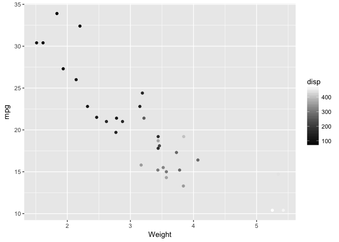

There is a lot of talk about the <b>ggplot2</b> package and the pipe. <a href="https://community.rstudio.com/t/why-cant-ggplot2-use/4372/7">Should it be used?</a> Some approaches, like the <a href="https://github.com/zeehio/ggpipe"><b>ggpipe</b> package</a>, replace many <strong>ggplot2</strong> functions, adding the plot as the first argument so they can be used with the pipe. This ignores the fact that <strong>ggplot2</strong> functions construct objects that can (and should) be re-used. Verbifying these noun functions to perform the task of creating the object <em>and</em> updating the plot object is one approach, and recently I wrote an <a href="https://github.com/paleolimbot/ggverbs">experimental R package</a> that implements it in just under 50 lines of code.

Constructing a plot using the <b>ggplot2</b> package is like adding a bunch of things together. Right? Except the verb "add" isn't a particularly good verb for some of the things we use the <code>+</code> symbol for. Consider the following example:


``` r
ggplot(mtcars, aes(wt, mpg, col = disp)) + 
  geom_point() +
  scale_colour_gradient(low = "black", high = "white") +
  labs(x = "Weight")
```


In the above code, `+ geom_point()` **adds** a layer to the plot, `+ scale_colour_gradient(low = "black", high = "white")` **replaces** (or **sets**) the colour scale, and `+ labs(x = "Weight")` **updates** the current set of labels. In the [**ggverbs** package](https://github.com/paleolimbot), the multitude of element constructors (currently nouns) are transformed into verbs that describe what they do to the plot. This has the added benefit of using the pipe (`%>%`) rather than the `+` operator to construct a plot, without masking any functions exported by **ggplot2**.

``` r
library(ggverbs)
ggplot(mtcars, aes(wt, mpg, col = disp)) %>%
  add_geom_point() %>%
  set_scale_colour_gradient(low = "black", high = "white") %>%
  update_labs(x = "Weight")
```



The [**ggverbs** package](https://github.com/paleolimbot) doesn't actually define any functions. Instead, it uses whatever the currently installed version of **ggplot2** exports, and uses a couple of regular expressions to change nouns into verbs. This has the advantage of not depending on any particular version of **ggplot2**, and because the functions are created on namespace load, it isn't bothered by the user updating **ggplot2**, and doesn't care if you have either package attached. The list of regexes looks something like this:

``` r
verbs_regexes <- c(
    "^aes_?$" = "update",
    "^aes_(string|q)$" = "update",
    "^layer$"  = "add",
    "^(geom|stat|annotation)_" = "add",
    "^scale_[a-z0-9]+_[a-z0-9]+$" = "set",
    "^theme_(?!get|set|update|replace)[a-z]+$" = "set",
    "^theme$" = "update",
    "^coord_(?!munch)[a-z]+$" = "set",
    "^facet_" = "set",
    "^labs$" = "update",
    "^guides$" = "update"
  )
```

Verbifying noun functions currently takes the strategy of modifying the call to the verb function to remove the `.plot` argument and pass on all the others. This has the advantage of keeping the autocomplete of arguments, although there is still no way to use R's help system with this approach. It throws 1 WARNING on the R CMD check (undocumented objects, naturally), but only consists of about 47 lines of code.
