This post covers creating stratigraphic diagrams using <a href="https://ggplot2.tidyverse.org/">ggplot2</a>, highlighting the helpers contained within the <a href="https://github.com/paleolimbot/tidypaleo">tidypaleo package</a>, which I've been using for the past few months to create diagrams. I chose the <strong>ggplot2</strong> framework because it is quite flexible and can be used to create almost any time-stratigraphic diagram except ones that involve multiple axes (we can have a fight about whether or not those are appropriate anyway, but if you absolutely need to create them I suggest you look elsewhere). To follow along, it will help considerably if you are already familiar with <strong>ggplot2</strong> (<a href="http://r4ds.had.co.nz/data-visualisation.html">a great tutorial can be found here</a>).


First, you will need to load the packages. For this tutorial, I will use **tidypaleo**, and the **tidyverse** (this includes **ggplot2**). Later, I will use **patchwork** to create more complex plots (you can install this from GitHub using `devtools::install_packages("thomasp85/patchwork")`, and **mudata2** because it contains more example data that is useful for illustrating plot data from multiple cores. I prefer the `theme_bw()` theme for **ggplot2** plots, so I will set this here as well. Setting the base font size to a small value (8 pt in this case) helps with strat diagrams.

``` r
library(tidyverse)
library(tidypaleo)
theme_set(theme_bw(8))
```

Next, you will need to load the example data. This vignette uses 3 datasets that are already in the correct format for plotting. These are datasets in the **tidypaleo** package: `alta_lake_geochem`, `keji_lakes_plottable`, and `halifax_lakes_plottable`. These represent three common dataset types for which stratigraphic plots are created.

``` r
data("alta_lake_geochem")
data("keji_lakes_plottable")
data("halifax_lakes_plottable")
```

Geochemical stratigraphic plots
-------------------------------

Geochemical stratigraphic plots include any kind of plot where each panel of the plot should be scaled to the minimum and maximum of the data. This includes (most) non-species abundance data. The example data, `alta_lake_geochem`, is a data frame in parameter-long (one row per measurement) form (you may need to use `gather()` to get your data into this form, which you can learn about in [this tutorial](http://r4ds.had.co.nz/tidy-data.html)). These measurements are from Alta Lake, British Columbia (Canada), and you can read more about them in the [journal article](https://doi.org/10.1007/s10933-016-9919-x).

``` r
alta_lake_geochem
#> # A tibble: 192 x 9
#>    location param depth   age value stdev units     n zone  
#>    <chr>    <chr> <dbl> <dbl> <dbl> <dbl> <chr> <int> <chr> 
#>  1 ALGC2    Cu    0.250  2015  76.0 NA    ppm       1 Zone 3
#>  2 ALGC2    Cu    0.750  2011 108    4.50 ppm       3 Zone 3
#>  3 ALGC2    Cu    1.25   2008 158   NA    ppm       1 Zone 3
#>  4 ALGC2    Cu    1.75   2003 169   NA    ppm       1 Zone 3
#>  5 ALGC2    Cu    2.50   1998 161   NA    ppm       1 Zone 3
#>  6 ALGC2    Cu    3.50   1982 129   NA    ppm       1 Zone 3
#>  7 ALGC2    Cu    4.50   1966  88.7  3.86 ppm       3 Zone 2
#>  8 ALGC2    Cu    5.50   1947  65.0 NA    ppm       1 Zone 2
#>  9 ALGC2    Cu    6.50   1922  62.3  9.53 ppm       3 Zone 2
#> 10 ALGC2    Cu    7.50   1896  48.0 NA    ppm       1 Zone 2
#> # ... with 182 more rows
```

Plotting a single core with `ggplot()` involves several steps:

-   The initial `ggplot()` call, where we set which columns will get mapped to the `x` and `y` values for each layer.
-   Two layers: `geom_lineh()` and `geom_point()`. We use `geom_lineh()` because our plots will be oriented vertically (`geom_line()` is designed for horizontal plots).
-   Specify how data are divided between facets using `facet_geochem_gridh()` (we use `_gridh()` to orient the panels horizontally rather than vertically).
-   Reverse the Y-axis, so that a depth of 0 is at the top.
-   Remove the X label, and set the Y label to "Depth (cm)".

``` r
alta_plot <- ggplot(alta_lake_geochem, aes(x = value, y = depth)) +
  geom_lineh() +
  geom_point() +
  scale_y_reverse() +
  facet_geochem_gridh(vars(param)) +
  labs(x = NULL, y = "Depth (cm)")

alta_plot
```


That's it! Of course, there are many modifications that can be made, which are covered in the next few sections.

### Adding annotations

It is common to highlight certain depths or ages on strat diagrams, or to add things to various places on a plot. This is accomplished by adding additional layers to the plot. For example, highlighting the depth at which the zones change (according to the paper, this is at 4 cm and 16 cm).

``` r
alta_plot +
  geom_hline(yintercept = c(4, 16), col = "red", lty = 2, alpha = 0.7)
```


The `geom_hline()` function creates its own data using the `yintercept` argument, but other geometries require us to create our own data. For example, highlighting the middle zone using `geom_rect()` would look like this:

``` r
zone_data <- tibble(ymin = 4, ymax = 16, xmin = -Inf, xmax = Inf)
alta_plot +
  geom_rect(
    mapping = aes(ymin = ymin, ymax = ymax, xmin = xmin, xmax = xmax), 
    data = zone_data, 
    alpha = 0.2,
    fill = "blue",
    inherit.aes = FALSE
  )
```

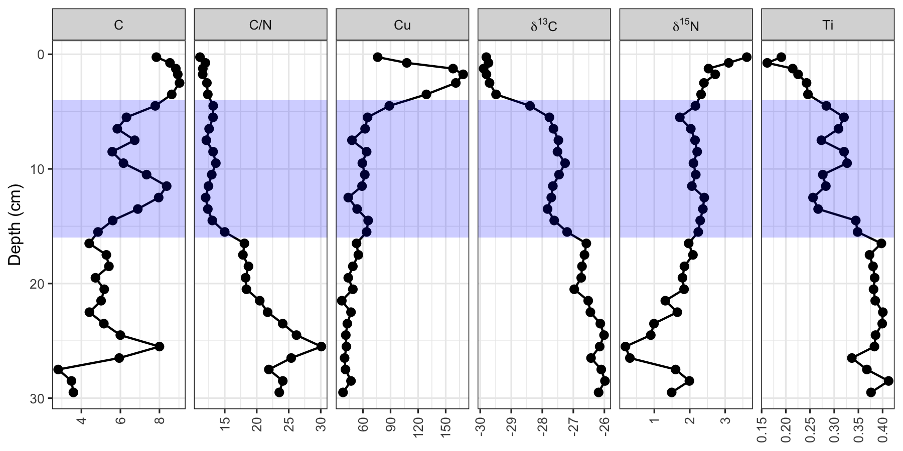

So far, each new layer we have added has been propogated to all facets. To restrict annotations to a specific facet, we need to include the facetting column (in this case, `param`) in the layer data. The element copper (Cu) has standards set by the Canadian government (ISQG of 35.7 ppm), and highlighting values that are outside that range can be done in a similar way to highlighting the middle zone.

``` r
cu_standard_data <- tibble(param = "Cu", xmin = 35.7, xmax = Inf, ymin = -Inf, ymax = Inf)
alta_plot +
  geom_rect(
    mapping = aes(ymin = ymin, ymax = ymax, xmin = xmin, xmax = xmax), 
    data = cu_standard_data, 
    alpha = 0.2,
    fill = "red",
    inherit.aes = FALSE
  )
```


To highlight the syntax that changed from the original plot, I've been using `alta_plot + ...`, however with layers such as these, it may be desirable to have the annotation appear under the original data. To do this, you would have to add your annotation layer (`geom_rect()`) before your data layer (`geom_lineh()` and `geom_point()`).

### Error bars

In the `alta_lake_geochem` data frame, there is a column for standard deviation (`stdev`). You can plot these values as error bars using `geom_errorbarh()`.

``` r
alta_plot + 
  geom_errorbarh(aes(xmin = value - stdev, xmax = value + stdev), height = 0.5)
```

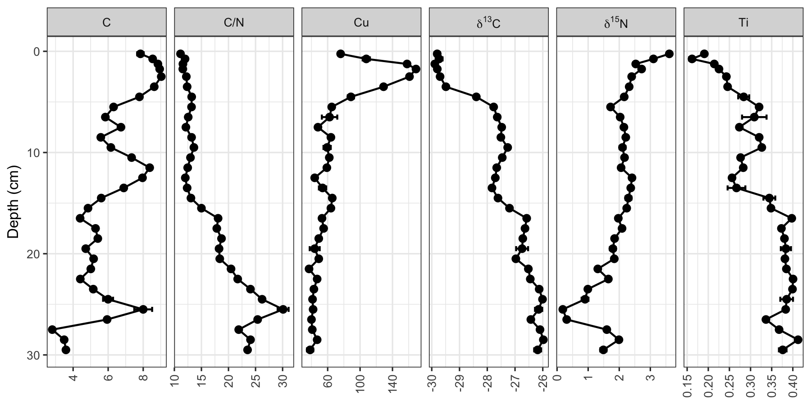

### Reordering facets

To control the order of the facets, the column on which they are facetted (`param`) must be a `factor()`, where the `levels` indicate the order. I suggest using `fct_relevel()` to do this, so that you only need to specify which items should go first. Usually I do this using a pipe (`%>%`) and `mutate()` to avoid assigning any intermediate variables.

``` r
alta_lake_geochem %>%
  mutate(param = fct_relevel(param, "Ti", "Cu", "C/N")) %>%
  ggplot(aes(x = value, y = depth)) +
  ...
```

    #> Warning: package 'bindrcpp' was built under R version 3.4.4


### Plotting a subset of the data

The `halifax_geochem` data frame was designed so that it is a reasonable number of parameters to plot at one time. Usually you will have a data frame with many more parameters, which you can subset using `filter()` before calling `ggplot()`. Usually I do this using a pipe (`%>%`) to avoid assigning any intermediate variables.

``` r
alta_lake_geochem %>%
  filter(param %in% c("d15N", "d13C", "C/N")) %>%
  ggplot(aes(x = value, y = depth)) +
  ...
```


### Using a y-axis with ages and depths

When plotting a single core, it is good practice to plot both ages and depths in the core. In **ggplot2**, this comes as a second axis generated by a helper function, `scale_y_depth_age()`, that uses an `age_depth_model()` to produce a second axis. For Alta Lake, the age depth model as published is included in the `alta_lake_bacon_ages` object. It's possible to set the age breaks using the `age_breaks` argument, and the labels using the `age_labels` argument (this is useful for adding error information to ages on a second axis). The axis title can be set using the `age_name` argument.

``` r
alta_adm <- age_depth_model(
  alta_lake_bacon_ages, 
  depth = depth_cm,
  age = 1950 - age_weighted_mean_year_BP
)

alta_plot +
  scale_y_depth_age(
    alta_adm,
    age_name = "Age (Year AD)"
  )
```

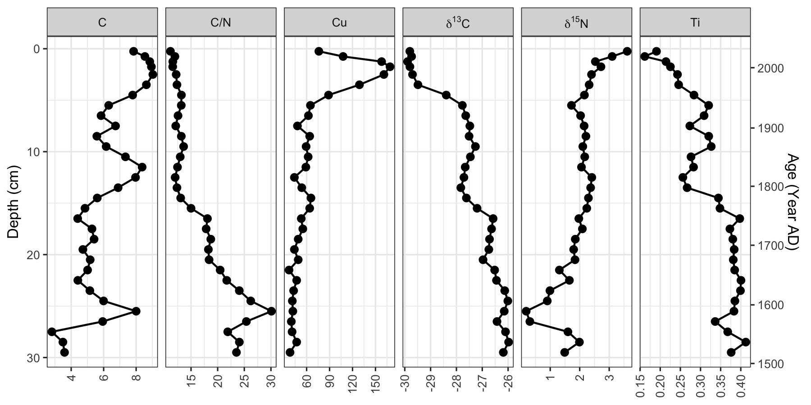

### Adding units to facet labels

Ideally, we'd like to specify the unit in which each of these parameters was measured. This can be done (1) by renaming each parameter before it gets to `ggplot()`, or (2) by using the `units` argument of the `facet_geochem_*()` functions. I suggest using the second option because it maintains the order of the parameters that you've chosen, and keeps the automatic reformatting of `d13C`. The `units` argument takes a named character vector, which you can create using `c("parameter" = "unit")`. If most paremeters are in the same unit, you can pass the default unit using `default_unit = "unit"`, and if you need to suppress a unit for an item, you can use `NA`.

``` r
alta_plot +
  facet_geochem_gridh(
    vars(param),
    units = c("C/N" = NA, "Cu" = "ppm", "d13C" = "‰", "d15N" = "‰"),
    default_units = "%"
  )
```


### Multiple cores

So far we've plotted one core. That's great, but often there is more than one core that needs to be plotted. There are two ways to go about this depending on how you would like identical parameters for each lake to be compared: using `facet_geochem_gridh()` will stretch the axis limits to fit values from both cores, and creating (and combining) two separate plots using `patchwork::wrap_plots()` will result in each panel stretching to the min/max of the data for that parameter. We'll illustrate both of these using some other data from Long Lake, Nova Scotia, that is contained in the **mudata2** package.

``` r
library(mudata2)
combined_data <- long_lake %>%
  tbl_data() %>%
  bind_rows(alta_lake_geochem) %>%
  filter(param %in% c("C/N", "d13C", "d15N"))

combined_data
#> # A tibble: 147 x 14
#>    dataset    location param depth value     sd units zone      n n_detect
#>    <chr>      <chr>    <chr> <dbl> <dbl>  <dbl> <chr> <chr> <int>    <int>
#>  1 long_lake… LL PC2   C/N    1.00  15.4 NA     <NA>  Unit…     1        1
#>  2 long_lake… LL PC2   C/N    6.00  15.8  0.290 <NA>  Unit…     2        2
#>  3 long_lake… LL PC2   C/N   11.0   24.0 NA     <NA>  Unit…     1        1
#>  4 long_lake… LL PC2   C/N   16.0   21.4 NA     <NA>  Unit…     1        1
#>  5 long_lake… LL PC2   C/N   21.0   23.2 NA     <NA>  Unit…     1        1
#>  6 long_lake… LL PC2   C/N   26.0   25.4 NA     <NA>  Unit…     1        1
#>  7 long_lake… LL PC2   C/N   43.0   27.2 NA     <NA>  Unit…     1        1
#>  8 long_lake… LL PC2   C/N   48.0   24.3 NA     <NA>  Unit…     1        1
#>  9 long_lake… LL PC2   C/N   53.0   30.2 NA     <NA>  Unit…     1        1
#> 10 long_lake… LL PC2   C/N   63.0   24.4 NA     <NA>  Unit…     1        1
#> # ... with 137 more rows, and 4 more variables: min_value <dbl>,
#> #   max_value <dbl>, age <dbl>, stdev <dbl>
```

First we'll go over the `facet_geochem_gridh()` approach, which adds `location` as another grouping variable. This will align parameters with themselves vertically, with one row on the plot per core. This usually the best option, as it makes values from one plot to another be directly comparable.

``` r
ggplot(combined_data, aes(x = value, y = depth)) +
  geom_lineh() +
  geom_point() +
  scale_y_reverse() +
  facet_geochem_gridh(vars(param), grouping = vars(location), scales = "free") +
  labs(x = NULL, y = "Depth (cm)")
```

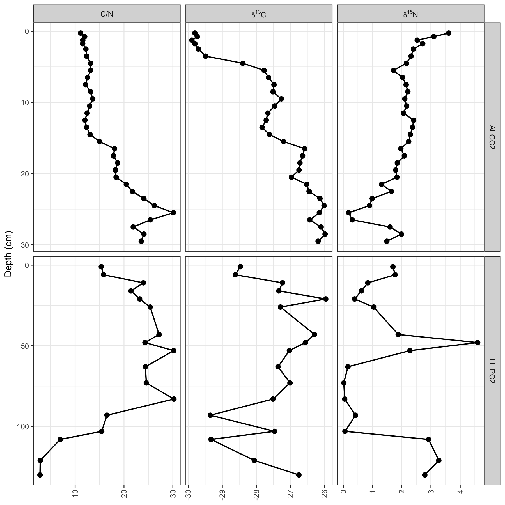

The other way to do this is to create two separate plots, and combine them using the **patchwork** package. This is a good option when values from one core to another are so different that placing them on the same axis results in trends being obscured, or when ages and depths are absolutely necessary for both plots (using `scale_y_depth_age()` doesn't work when combining locations using a facet).

``` r
alta_plot_1 <- combined_data %>% 
  filter(location == "ALGC2") %>% 
  ggplot(aes(x = value, y = depth)) +
  geom_lineh() +
  geom_point() +
  scale_y_reverse() +
  facet_geochem_gridh(vars(param), scales = "free") +
  labs(x = NULL, y = "Depth (cm)", title = "Alta Lake")

long_plot_2 <- combined_data %>% 
  filter(location == "LL PC2") %>% 
  ggplot(aes(x = value, y = depth)) +
  geom_lineh() +
  geom_point() +
  scale_y_reverse() +
  facet_geochem_gridh(vars(param), scales = "free") +
  labs(x = NULL, y = "Depth (cm)", title = "Long Lake")

library(patchwork)
wrap_plots(alta_plot_1, long_plot_2, ncol = 1)
```


### Adding a dendrogram

It's fairly common to see a CONISS dendrogram at the right of plots, and so **tidypaleo** wouldn't be complete if it couldn't make that happen. For a variety of technical reasons, you have to specify that you need `depth` mapped to the `y` aesthetic for both `layer_zone_boundaries()` and `layer_dendrogram()`. Note that you'll have to do CONISS using `nested_chclust_coniss()`, which uses the **rioja** package to do the constrained cluster analysis. By default, this will calculate the number of plausible zones based on a broken stick simulation.

``` r
coniss <- alta_lake_geochem %>%
  nested_data(qualifiers = c(age, depth), key = param, value = value, trans = scale) %>%
  nested_chclust_coniss()

alta_plot +
  layer_dendrogram(coniss, aes(y = depth), param = "CONISS") +
  layer_zone_boundaries(coniss, aes(y = depth))
```

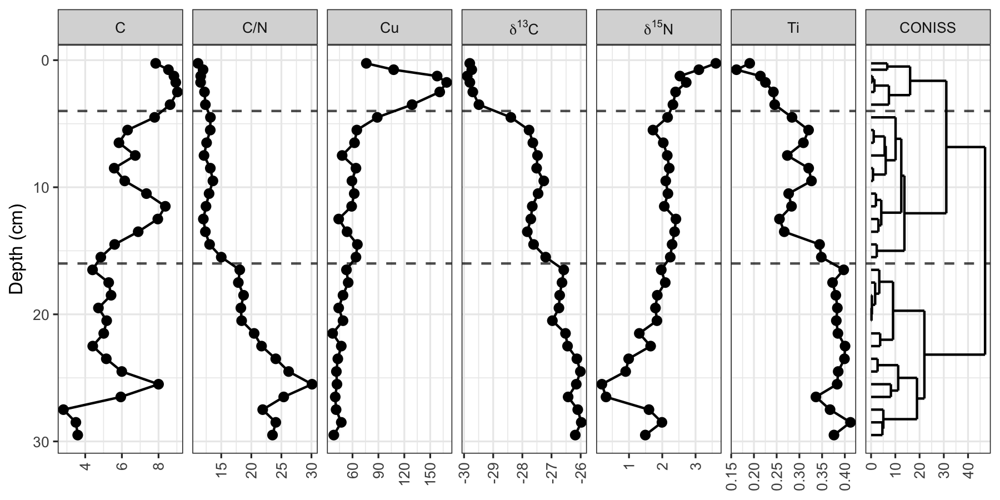

### Using `facet_geochem_wraph()`

If you are familiar with `facet_grid()` in **ggplot2**, you will notice that `facet_geochem_gridh()` has done a few things differently, including automatically renaming `d13C` and `d15N` to the proper formatting. This function also rotates axis labels, because this is the only sure-fire way to make sure they don't overlap. You can un-rotate them using `rotate_axis_labels = 0`, and you can wrap panels in a defined number of rows or columns using `facet_geochem_wraph()`. This works well for plotting a larger number of parameters when there is only one core involved.

``` r
alta_plot + 
  facet_geochem_wraph(vars(param), rotate_axis_labels = 0, ncol = 4)
```

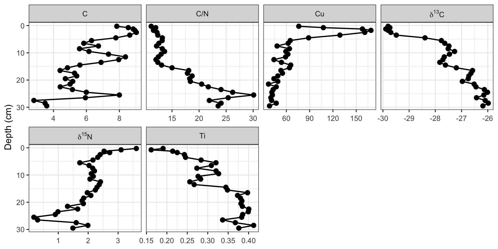

### Going horizontal

Most stratigraphic diagrams are vertical, which is a reflection on the orientation of the core from which the data came. In many cases (especially when age is one of the axes), it may be adventageous to have the plots be horizontal, with time running from left to right along the x-axis. A few things need to change from our original plot, including the mapping, the line geometry, and the facet specification. Here I've used `facet_geochem_grid()` to stack the plots vertically, but you could also use `facet_geochem_wrap()`.

``` r
ggplot(alta_lake_geochem, aes(x = age, y = value)) +
  geom_line() +
  geom_point() +
  scale_y_reverse() +
  facet_geochem_grid(vars(param)) +
  labs(x = "Age (Year AD)", y = NULL)
```

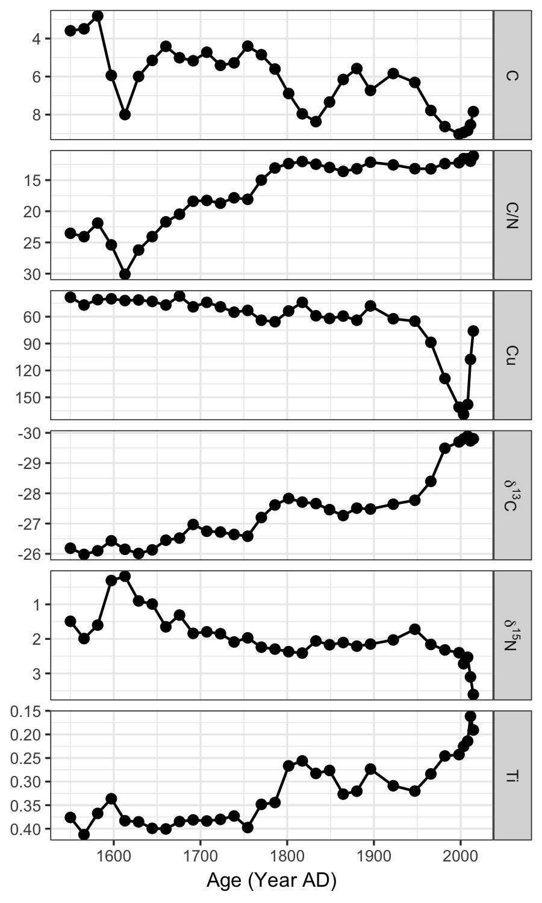

Species abundance stratigraphic plots
-------------------------------------

If our data is relative species abundance, there are a few more restrictions on the plot: each facet must represent values such that 10% abundance on one facet is equal to 10% in another facet, and facet names are often long enough that they must be rotated. The sample data for these exercises is `keji_lakes_plottable`, which again is in the form of one row per measurement. This dataset contains two lakes, Beaverskin Lake and Peskawa Lake, both located within Keji National Park, Nova Scotia, Canada ([Ginn et al. 2007](https://doi.org/10.1007/s10750-007-0644-3)).

``` r
data("keji_lakes_plottable")
keji_lakes_plottable
#> # A tibble: 202 x 5
#>    location        depth taxon                             count rel_abund
#>    <chr>           <dbl> <fct>                             <dbl>     <dbl>
#>  1 Beaverskin Lake 0.125 Asterionella ralfsii var. ameri…   0         0   
#>  2 Beaverskin Lake 0.125 Aulacoseira distans                7.00      3.02
#>  3 Beaverskin Lake 0.125 Aulacoseira lirata                 4.00      1.72
#>  4 Beaverskin Lake 0.125 Cyclotella stelligera              8.00      3.45
#>  5 Beaverskin Lake 0.125 Tabellaria flocculosa (strain I…   0         0   
#>  6 Beaverskin Lake 0.125 Other                            213        91.8 
#>  7 Beaverskin Lake 0.375 Asterionella ralfsii var. ameri…   0         0   
#>  8 Beaverskin Lake 0.375 Aulacoseira distans                8.00      3.25
#>  9 Beaverskin Lake 0.375 Aulacoseira lirata                 5.00      2.03
#> 10 Beaverskin Lake 0.375 Cyclotella stelligera             14.0       5.69
#> # ... with 192 more rows
```

The code to generate the plot is similar to our previous plots, except we use `geom_col_segsh()` (which instead of points or a path, draws lines connected to the x-axis), and `facet_abundanceh()` (which takes care of rotating facet labels, partially italicizing them, and setting the scales for each panel to start at 0.

``` r
keji_plot <- ggplot(keji_lakes_plottable, aes(x = rel_abund, y = depth)) +
  geom_col_segsh() +
  scale_y_reverse() +
  facet_abundanceh(vars(taxon), grouping = vars(location)) +
  labs(x = "Relative abundance (%)", y = "Depth (cm)")

keji_plot
```

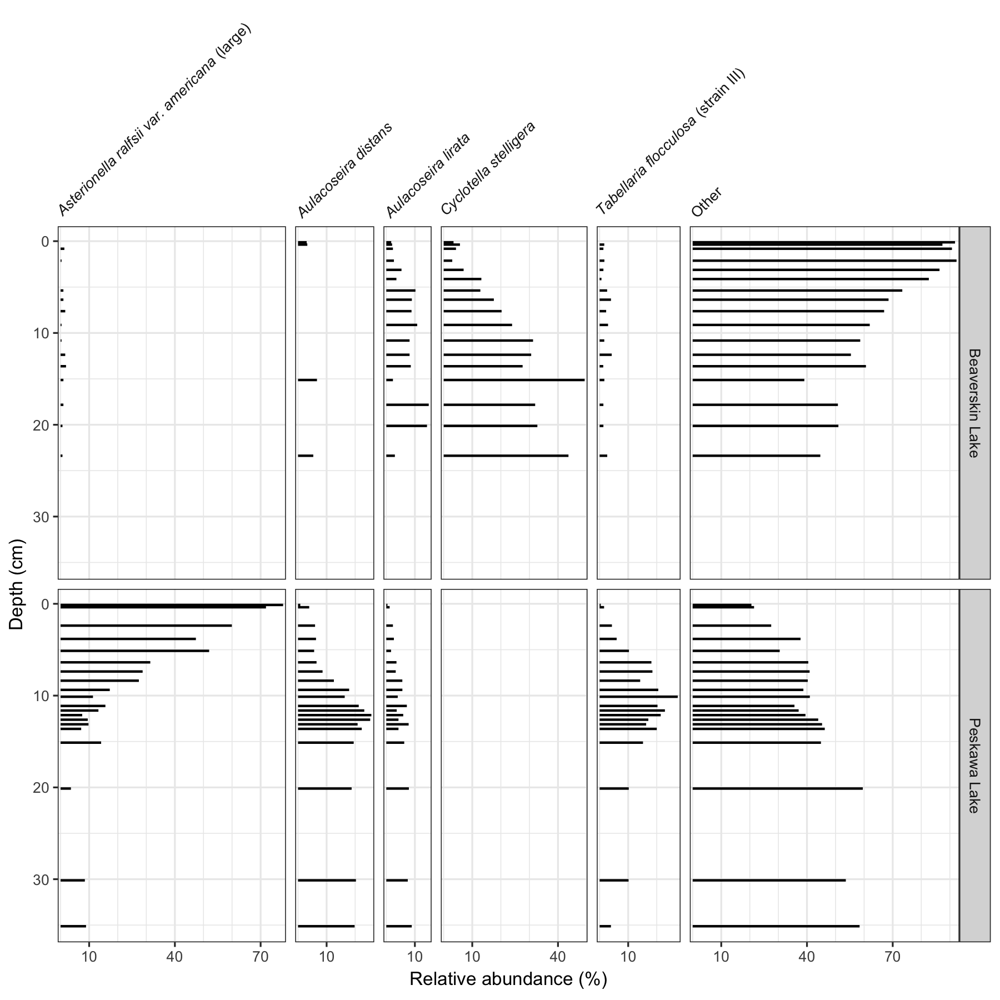

Most of the modifications you can make on these plots are identical to the modifications you can make on non-abundance plots (see previous section), except for a few that we describe below.

### Different styles

There are a few famous styles for abundance plots, because a few existing programs (like [Tilia](https://www.tiliait.com/), [C2](https://www.staff.ncl.ac.uk/stephen.juggins/software/C2Home.htm), and [rioja](https://cran.r-project.org/package=rioja)) have some very specific defaults that show up on repeat in the literature. These styles can be replicated by changing or adding to `geom_col_segsh()`. For example, the classic Tilia "area" style for pollen diagrams:

``` r
ggplot(keji_lakes_plottable, aes(x = rel_abund, y = depth)) +
  geom_areah() +
  scale_y_reverse() +
  facet_abundanceh(vars(taxon), grouping = vars(location)) +
  labs(x = "Relative abundance (%)", y = "Depth (cm)")
```

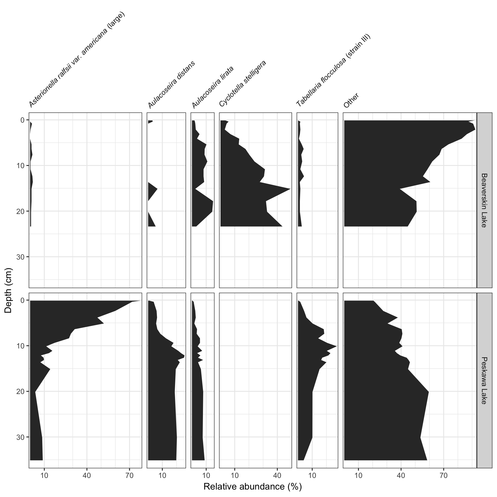

Or for rioja-style diagrams, use `geom_col_segsh()` plus `geom_lineh()`:

``` r
ggplot(keji_lakes_plottable, aes(x = rel_abund, y = depth)) +
  geom_col_segsh() + 
  geom_lineh() +
  scale_y_reverse() +
  facet_abundanceh(vars(taxon), grouping = vars(location)) +
  labs(x = "Relative abundance (%)", y = "Depth (cm)")
```


### Exaggerating low-abundance taxa

It's common to see some kind of geometry on abundance diagrams exaggerating low-abundance variation. You can use the `*_exaggerate()` varieties of `geom_lineh()`, `geom_areah()`, and `geom_point()` to display this information without affecting the scales. If you want to include it only for certain taxa, you can pass `data = keji_lakes_plottable %>% filter(...)` to only include certain measurements.

``` r
keji_plot +
  geom_lineh_exaggerate(exaggerate_x = 5, col = "grey70", lty = 2)
```


### Adding non-abundance data

To add non-abundance data in the same figure, we need to create two plots and combine them using **patchwork**'s `wrap_plots()` function. In this example, I'm going to use PCA scores, computed by the `nested_prcomp()` function, and get them into parameter-long form using `gather()`. Note that when I create the plots, I make sure the labels still exist, and then I nix the labels inbetween the two plots using a few `theme()` modifications. It's important to make sure that the panel labels and scale lables are the same before removing them!

``` r
keji_pca_scores <- keji_lakes_plottable %>%
  group_by(location) %>%
  nested_data(qualifiers = depth, key = taxon, value = rel_abund, trans = sqrt) %>%
  nested_prcomp() %>%
  unnest(qualifiers, scores) %>%
  gather(key = component, value = value, starts_with("PC")) %>%
  filter(component %in% c("PC1", "PC2"))

keji_pca_plot <- ggplot(keji_pca_scores, aes(x = value, y = depth)) +
  geom_lineh() +
  geom_point() +
  scale_y_reverse() +
  facet_geochem_gridh(vars(component), grouping = vars(location)) +
  labs(x = NULL)
  
library(patchwork)
wrap_plots(
  keji_plot + 
    theme(strip.background = element_blank(), strip.text.y = element_blank()),
  keji_pca_plot +
    theme(axis.text.y.left = element_blank(), axis.ticks.y.left = element_blank()) +
    labs(y = NULL),
  nrow = 1,
  widths = c(4, 1)
)
```

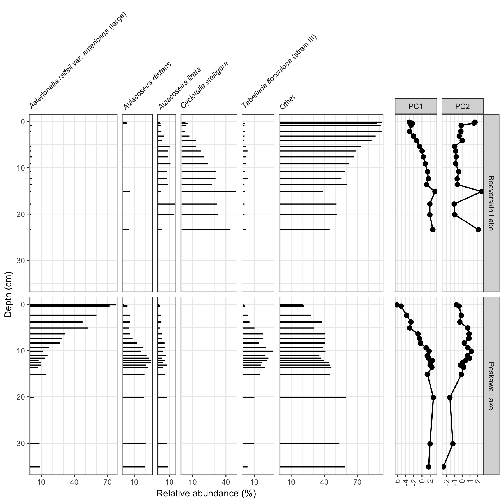

### Adding dendrograms

Adding a CONISS (or other) dendrogram created using `nested_chclust_coniss()` can be done in two ways: if there is already a non-abundance plot that exists, the dendrogram can be added to that plot using `layer_dendrogram()`. If there is not already a non-abundance plot, we need to create that plot. Then, the two plots can be combined using **patchwork**'s `wrap_plots()`.

``` r
keji_coniss <- keji_lakes_plottable %>%
  group_by(location) %>%
  nested_data(qualifiers = depth, key = taxon, value = rel_abund) %>%
  nested_chclust_coniss()

library(patchwork)

# method 1: use existing non-abundance plot
wrap_plots(
  keji_plot + 
    theme(strip.background = element_blank(), strip.text.y = element_blank()),
  keji_pca_plot +
    layer_dendrogram(keji_coniss, component = "CONISS", aes(y = depth)) +
    theme(axis.text.y.left = element_blank(), axis.ticks.y.left = element_blank()) +
    labs(y = NULL),
  nrow = 1,
  widths = c(2, 1)
)
```

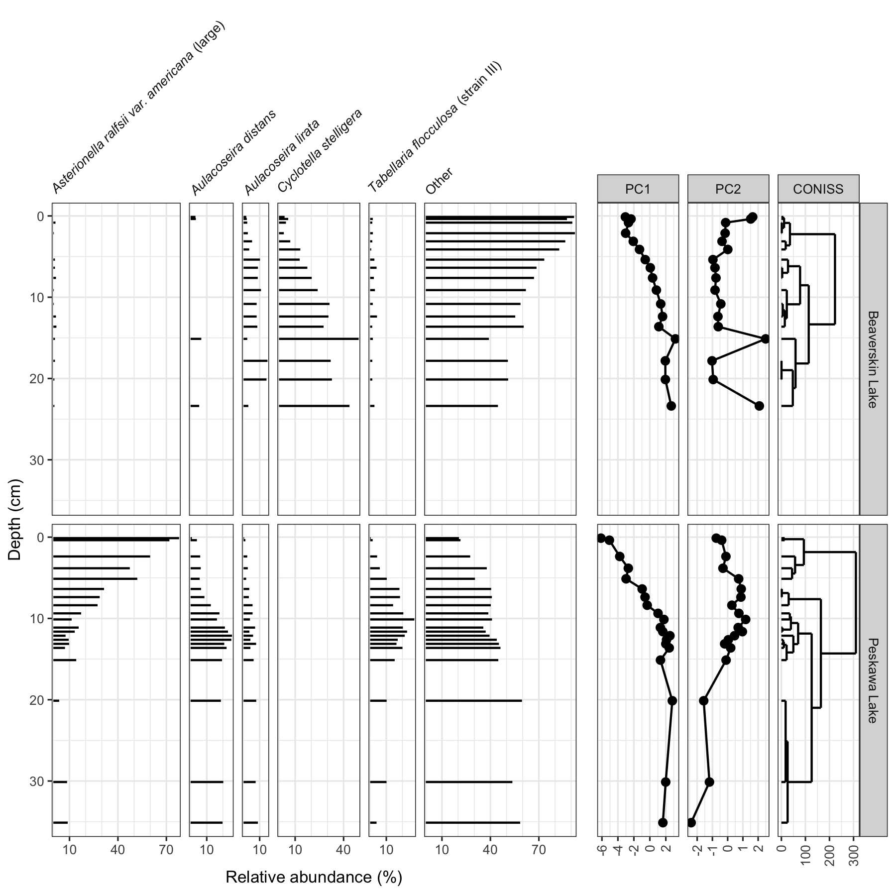

``` r
# method 2: create a standalone plot for CONISS
coniss_plot <- ggplot() +
  layer_dendrogram(keji_coniss, aes(y = depth)) +
  scale_y_reverse() +
  facet_geochem_gridh(vars("CONISS"), grouping = vars(location)) +
  labs(x = NULL)

wrap_plots(
  keji_plot + 
    theme(strip.background = element_blank(), strip.text.y = element_blank()),
  coniss_plot +
    theme(axis.text.y.left = element_blank(), axis.ticks.y.left = element_blank()) +
    labs(y = NULL),
  nrow = 1,
  widths = c(6, 1)
)
```

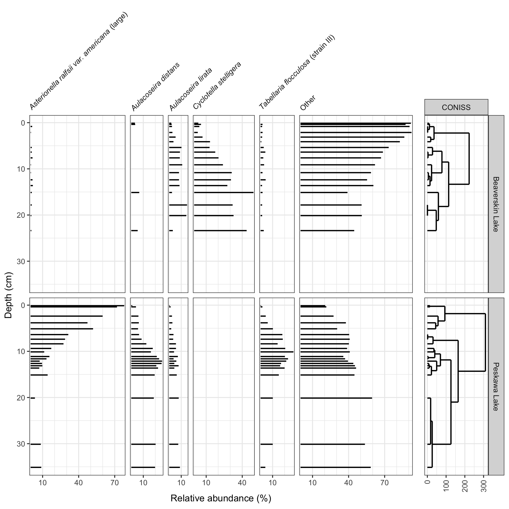

Top/bottom/spatial diagrams
---------------------------

So far we have looked at data that have depth as an axis. Another sample strategy includes collecting cores with a small number of samples in each (such as top/bottom, or sometimes just a surface sample). A sample dataset of this type was collected by [Ginn et al. (2015)](https://doi.org/10.1080/10402381.2015.1013648) in lakes near Halifax, Nova Scotia. A subset of these measurements can be found in the `halifax_lakes_plottable` data frame.

``` r
data("halifax_lakes_plottable")
halifax_lakes_plottable
#> # A tibble: 114 x 5
#>    location      sample_type taxon                         count rel_abund
#>    <chr>         <chr>       <fct>                         <dbl>     <dbl>
#>  1 Anderson Lake bottom      Aulacoseira distans           26.0      4.65 
#>  2 Anderson Lake bottom      Eunotia exigua                13.5      2.42 
#>  3 Anderson Lake bottom      Fragilariforma exigua          6.50     1.16 
#>  4 Anderson Lake bottom      Tabellaria fenestrata         23.0      4.11 
#>  5 Anderson Lake bottom      Tabellaria flocculosa (stra…  21.0      3.76 
#>  6 Anderson Lake bottom      Other                        469       83.9  
#>  7 Anderson Lake top         Aulacoseira distans            8.50     1.87 
#>  8 Anderson Lake top         Eunotia exigua                 0        0    
#>  9 Anderson Lake top         Fragilariforma exigua          1.50     0.330
#> 10 Anderson Lake top         Tabellaria fenestrata         26.0      5.71 
#> # ... with 104 more rows
```

These diagrams are essentially bar charts, and use `geom_colh()` to draw their geometry (this works better than `geom_col_segsh()`, which only draws a thin line). We can separate top/bottom samples by setting an additional aesthetic, `fill = sample_type`, and make sure they dodge vertically by setting `position = "dodgev"`.

``` r
halifax_plot <- ggplot(halifax_lakes_plottable, aes(x = rel_abund, y = location, fill = sample_type)) +
  geom_colh(width = 0.5, position = "dodgev") +
  facet_abundanceh(vars(taxon)) +
  labs(x = "Relative abundance (%)", y = NULL, fill = "Sample Type")

halifax_plot
```


### Ordering lakes on the y-axis

Diagrams with a discrete axis (in this case, the y-axis) tend to be most efffective when they are ordered in some way. By default, **ggplot2** orders them alphabetically and lists them bottom to top. We can change this order in a similar way to changing the facet order, which is to convert the column containing the y-variable to a `factor()` using `fct_relevel()`. In this context, `fct_rev()` is also useful, as it will result in a top-to-bottom ordering rather than a bottom-to-top one.

``` r
halifax_lakes_plottable %>%
  mutate(location = fct_relevel(location, "Bell Lake", "Bayers", "Little Springfield") %>% fct_rev()) %>%
  ggplot(aes(x = rel_abund, y = location, fill = sample_type)) +
  ...
```

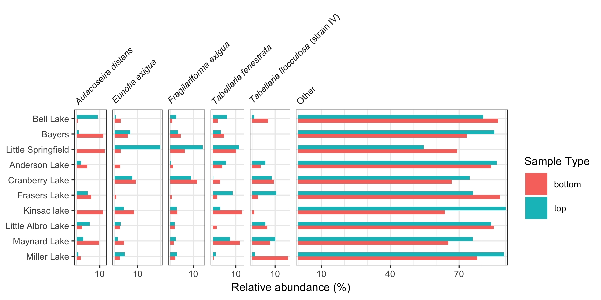

### Adding a dendrogram

Adding a dendrogram to a plot with a discrete axis is only tricky because the order of the axes depends on the dendrogram itself. This means that the axes for both plots rely on the result of the clustering.

``` r
halifax_clust <- halifax_lakes_plottable %>%
  filter(sample_type == "top") %>%
  nested_data(qualifiers = location, key = taxon, value = rel_abund) %>%
  nested_hclust(method = "average")

dendro_order <- halifax_clust %>%
  unnest(qualifiers, dendro_order) %>%
  arrange(dendro_order) %>% 
  pull(location)

library(patchwork)
wrap_plots(
  halifax_plot + 
    scale_y_discrete(limits = dendro_order) +
    theme(legend.position = "left"),
  ggplot() + 
    layer_dendrogram(halifax_clust, aes(y = location)) +
    scale_y_discrete(limits = dendro_order) +
    labs(x = "Dispersion", y = NULL) +
    theme(axis.text.y.left = element_blank(), axis.ticks.y.left = element_blank()),
  widths = c(4, 1)
)
```

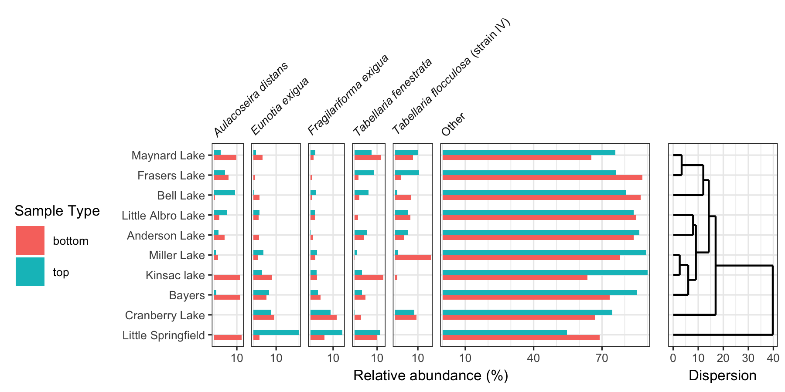

