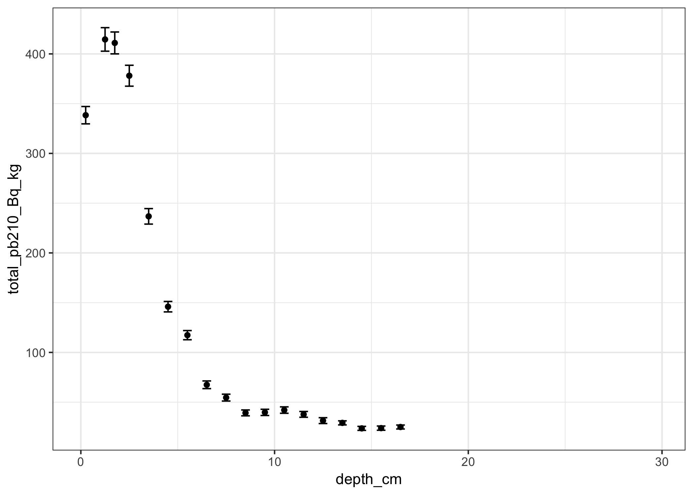
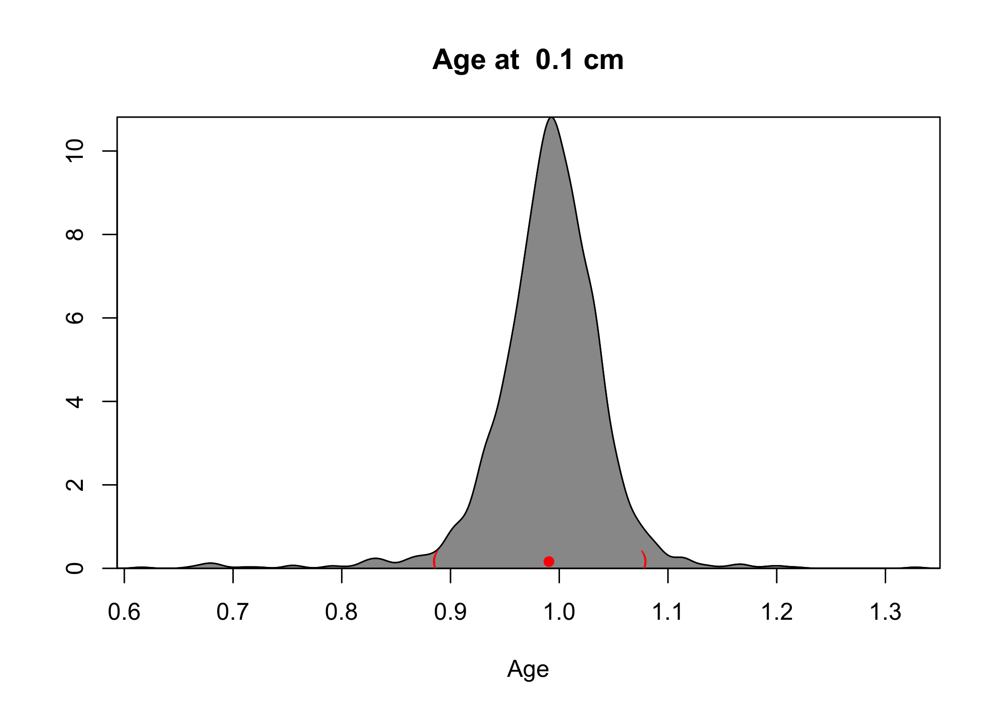
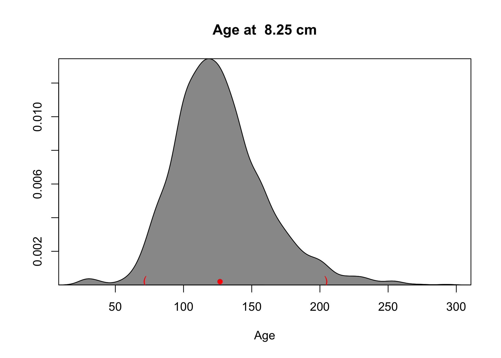
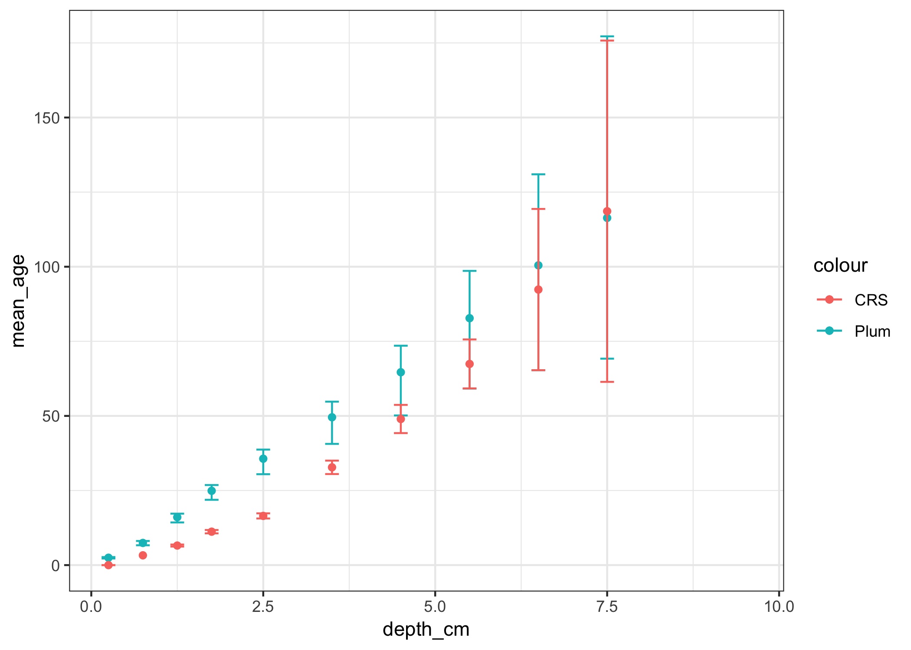

Paleolimnologists have been using the <a href="http://doi.org/10.1007/BF00028424">Constant Rate of Supply (CRS) and Constant Initial Concentration (CIC)</a> model to interpret <sup>210</sup>Pb dates for a very long time. Some variations like propagating error using a Monte Carlo simulation (<a href="https://doi.org/10.1007/BF00219461">Binford 1990</a> and <a href="https://doi.org/10.1016/j.quageo.2014.06.002">Sanchez-Cabeza et al. 2014</a>) instead of the usual “quadrature” method have been used, but for the most part, we have been interpreting lead-210 dates the same way since 1978 (40 years!).


We can definitely do better. Similar to how [Bacon](https://cran.r-project.org/package=rbacon) revolutionized the <sup>14</sup>C dating world, Bayesian methods are the future of <sup>210</sup>Pb dating as well. Bayesian methods are a bit hard to understand, but essentially, they involve creating millions and millions of age-depth relationships, only selecting the ones that are probable given some constraints. In this case, the constraints are that we have <sup>210</sup>Pb activities that were measured (with some error), <sup>210</sup>Pb decays at a known rate (if we're being technical there's error here too, but it's always ignored), and the sedimentation rate of a given slice is related to the sedimentation rate of the previous slice. You can imagine that it would be possible to "check" any age-depth model to see if it actually would produce the <sup>210</sup>Pb activities that you measured. Bayesian age-depth model creation is that. But millions and millions of times, keeping only the age-depth models that make sense.

In 2018, the first (to my knowledge) [Bayesian <sup>210</sup>Pb interpretation paper](https://doi.org/10.1007/s13253-018-0328-7) was published, and included a [program to do the interpretation](https://github.com/maquinolopez/Plum). Having just wrote an [R package implementing the CIC and CRS models](http://github.com/paleolimbot/pb210), I thought I'd give it a go! It turns out that the program as written is difficult to use (the authors acknowledge that this version is just a draft, and the paper indicates that it may be translated to C++ in the future). Still, it's a massive step forward for those of us that rely on <sup>210</sup>Pb dating (which is almost all of us paleolimnologists).

### Some data

I'll use the Alta Lake <sup>210</sup>Pb measurements I have from my [first published paper](https://doi.org/10.1007/s10933-016-9919-x), which also happens to be the sample dataset for the [pb210 package](http://github.com/paleolimbot/pb210).

``` r
library(pb210)
alta_lake_pb210
```

    ## # A tibble: 32 x 13
    ##    sample_id depth_cm total_pb210_Bq_… total_pb210_sd section_start_cm
    ##    <chr>        <dbl>            <dbl>          <dbl>            <dbl>
    ##  1 AL-GC2-0      0.25            338.            8.71              0  
    ##  2 AL-GC2-0…     0.75             NA            NA                 0.5
    ##  3 AL-GC2-1      1.25            415.           11.8               1  
    ##  4 AL-GC2-1…     1.75            411.           11.0               1.5
    ##  5 AL-GC2-2      2.5             378.           10.5               2  
    ##  6 AL-GC2-3      3.5             237.            7.79              3  
    ##  7 AL-GC2-4      4.5             146.            5.25              4  
    ##  8 AL-GC2-5      5.5             117.            4.61              5  
    ##  9 AL-GC2-6      6.5              67.5           3.86              6  
    ## 10 AL-GC2-7      7.5              54.6           3.44              7  
    ## # … with 22 more rows, and 8 more variables: section_end_cm <dbl>,
    ## #   water_percent <dbl>, slice_mass_g <dbl>, dry_density_cm3 <dbl>,
    ## #   c_percent <dbl>, n_percent <dbl>, published_age_yr <dbl>,
    ## #   published_age_sd <dbl>

``` r
ggplot(alta_lake_pb210, aes(x = depth_cm, y = total_pb210_Bq_kg)) +
  geom_point() +
  geom_errorbar(
    aes(
      ymin = total_pb210_Bq_kg - total_pb210_sd, 
      ymax = total_pb210_Bq_kg + total_pb210_sd
    )
  )
```



### Using Plum

Plum (in its current form) is an R package that calls Python code to do the heavy lifting for the Bayesian statistics. Because it uses the **rPython** package, it can only be used on Unix-alike systems (Mac OS included!). On my MacOS machine, the following worked to install the R package.

```r
install.packages("rPython", configure.vars= "RPYTHON_PYTHON_VERSION=2")
remotes::install_github("maquinolopez/Plum")
```

If you can load the package, it's installed!

``` r
library(Plum)
```

    ## Loading required package: rPython

    ## Loading required package: RJSONIO

The **Plum** package requires its input as a CSV file (much like **rbacon**). I don't particularly like this kind of interface, but I do very much appreciate the ability to do Bayesian lead-210 analysis, and with the **tidyverse** functions at one's disposal, it's not too bad. The CSV has to have the columns `Depth (cm)`, `Density g/cm^3`, `210Pb (Bq/kg)`, `sd(210Pb)`, `Thickness (cm)`, `226Ra (Bq/kg)`, and `sd(226Ra)` (in that order!). The `226Ra (Bq/kg)`, and `sd(226Ra)` columns are options, according to the author's tutorial. In my case, I don't have any <sup>226</sup>Ra data, so I'll omit those columns. Note that everything has to be finite (no `NA` values!).

``` r
alta_lake_plum <- alta_lake_pb210 %>%
  filter(!is.na(total_pb210_Bq_kg)) %>%
  transmute(
    `Depth (cm)` = depth_cm, 
    `Density g/cm^3` = dry_density_cm3, 
    `210Pb (Bq/kg)` = total_pb210_Bq_kg, 
    `sd(210Pb)` = total_pb210_sd, 
    `Thickness (cm)` = section_end_cm - section_start_cm
  )

alta_lake_plum
```

    ## # A tibble: 18 x 5
    ##    `Depth (cm)` `Density g/cm^3` `210Pb (Bq/kg)` `sd(210Pb)`
    ##           <dbl>            <dbl>           <dbl>       <dbl>
    ##  1         0.25            0.169           338.         8.71
    ##  2         1.25            0.153           415.        11.8 
    ##  3         1.75            0.150           411.        11.0 
    ##  4         2.5             0.183           378.        10.5 
    ##  5         3.5             0.188           237.         7.79
    ##  6         4.5             0.229           146.         5.25
    ##  7         5.5             0.216           117.         4.61
    ##  8         6.5             0.269            67.5        3.86
    ##  9         7.5             0.191            54.6        3.44
    ## 10         8.5             0.197            39.2        2.95
    ## 11         9.5             0.276            39.7        3.13
    ## 12        10.5             0.280            42.1        3.22
    ## 13        11.5             0.183            37.7        2.90
    ## 14        12.5             0.210            31.5        2.93
    ## 15        13.5             0.254            29.2        2.03
    ## 16        14.5             0.276            23.7        2.00
    ## 17        15.5             0.343            23.9        2.11
    ## 18        16.5             0.494            25.0        1.98
    ## # … with 1 more variable: `Thickness (cm)` <dbl>


The CSV file needs to be in a very specific location in order for **Plum** to be able to find it. Apparently it needs to be given a core name, placed in a directory with that name, and be written to the file `<core_name>.csv` (within that directory). The documentation says this can be any folder, but I can't make it work in anything other than the default (`~/Plum`).

```r
dir.create("~/Plum/ALGC2", recursive = TRUE)
write_csv(alta_lake_plum, "cores/ALGC2/ALGC2.csv")
```

To run Plumb, use the `runPlumb()` function. Note that this takes about 5 minutes on my machine, and may take longer on others (if you have <sup>226</sup>Ra data and require that there is a different supported <sup>210</sup>Pb concentration for each depth, apparently it will take longer). You have to tell it how many samples (counting from the bottom) are "background" (if there's no <sup>226</sup>Ra data). There's some other options but it's difficult to tell exactly what they do.

```r
runPlum(Core.name = "ALGC2", number_supported = 9)
```

This function gave me a ton of errors, but I think they are all at the end when it's trying to plot everything. I don't want it to plot anything (I want the data output), so that's fine with me. At least, the functions to extract the age distribution of each sample (the whole point!) seem to work. From some trial and error, it looks like you can get the age distribution at any age down to 8.25 cm. I'm not sure what defines this depth, but it's helpful to know you will get a weird error if you request a depth that's too deep.

``` r
first_age <- ageof(x = 0.1, folder = "~/Plum/ALGC2")
```

<!-- -->

    ## [1] "the age of depth 0.1 is between"
    ## [1] 0.8861204 1.0776776
    ## [1] "with a 0.95% condifence interval and a mean of:"
    ## [1] 0.9904968

``` r
last_age <- ageof(x = 8.25, folder = "~/Plum/ALGC2")
```

<!-- -->

    ## [1] "the age of depth 8.25 is between"
    ## [1]  71.80778 204.28006
    ## [1] "with a 0.95% condifence interval and a mean of:"
    ## [1] 126.7365

Unfortunately, it insists on plotting the distribution for you. I really just want the data, which in this case is a vector of ages (1999 of them) according to a bunch (1999) of probable age-depth models given the data we collected. It's actually ingenious and is totally the way we should be interpreting age-depth models (but I could do without the plotting when I just want numbers).

Because `ageof()` fails given certain depths, extracting the distribution of ages for each sample is a little awkward. Here I use a little custom function that returns a `tibble()` instead of the list that is returned by `ageof()`.

```r
plum_ages <- function(depth) {
  plum_obj <- try(ageof(x = depth, folder = "~/Plum/ALGC2"), silent = TRUE)
  if(inherits(plum_obj, "try-error")) {
    tibble(
      mean_age = NA_real_, 
      lower_age = NA_real_, 
      upper_age = NA_real_, 
      data = list(numeric(0))
    )
  } else {
    tibble(
      mean_age = plum_obj$Mean, 
      lower_age = plum_obj$Lower_lim, 
      upper_age = plum_obj$Upper_lim, 
      data = list(plum_obj$Data)
    )
  }
}

alta_lake_ages <- alta_lake_pb210 %>%
  mutate(plum_raw = map(depth_cm, plum_ages)) %>%
  unnest()
```

``` r
alta_lake_ages %>%
  select(depth_cm, mean_age, lower_age, upper_age)
```

    ## # A tibble: 32 x 4
    ##    depth_cm mean_age lower_age upper_age
    ##       <dbl>    <dbl>     <dbl>     <dbl>
    ##  1     0.25     2.48      2.22      2.69
    ##  2     0.75     7.43      6.65      8.08
    ##  3     1.25    16.1      14.3      17.2 
    ##  4     1.75    24.9      21.9      26.8 
    ##  5     2.5     35.7      30.5      38.7 
    ##  6     3.5     49.5      40.6      54.8 
    ##  7     4.5     64.6      50.2      73.5 
    ##  8     5.5     82.7      59.1      98.6 
    ##  9     6.5    100.       65.3     131.  
    ## 10     7.5    116.       69.2     177.  
    ## # … with 22 more rows

Cool! Now we've got the data in an object we can plot. I'll put the ages that [we published](https://doi.org/10.1007/s10933-016-9919-x) on plot as well, for comparison.

``` r
alta_lake_ages %>%
  filter(depth_cm < 10) %>%
  ggplot(aes(x = depth_cm)) +
  geom_point(aes(y = mean_age, col = "Plum")) +
  geom_errorbar(
    aes(ymin = lower_age, ymax = upper_age, col = "Plum"), 
    width = 0.2
  ) +
  geom_point(aes(y = published_age_yr, col = "CRS")) +
  geom_errorbar(
    aes(
      ymin = published_age_yr - published_age_sd, 
      ymax = published_age_yr + published_age_sd,
      col = "CRS"
    ),
    width = 0.2
  )
```

<!-- -->

It's an interesting difference. It looks like the Plum model encourages more of a constant sedimentation rate than the CRS model (at least in my very limited dataset). Indeed, this is one of the assumptions of the Plum (and Bacon) age-depth model...that the sedimentation rate of one core slice is somewhat similar to that before it. It's mostly a good assumption (probably a better assumption than a wildly varying sedimentation rate that is frequently inferred by the CRS model). It's possible to set the prior distribution for this (I think it's called "memory"), which may help steer Plum in the right direction.

### The next step

Black-box solutions like Plum and Bacon are hard. They are hard to understand, and hard to depend on (code-wise) because they don't have any unit tests and thus may fail in unexpected ways. I think that it may be possible to code these models in [STAN](https://mc-stan.org/), which has [excellent R support](https://cran.r-project.org/package=rstan). STAN is a domain-specific language for Bayesian models that allows a model such as that for Bacon and Plum to be coded in a 10-20 lines, rather than hundreds of lines of Python or C++. I'm [taking a break from paleolimnology this summer](https://resources.rstudio.com/rstudio-blog/summer-interns-2019), but look forward to getting back to this in the fall!

